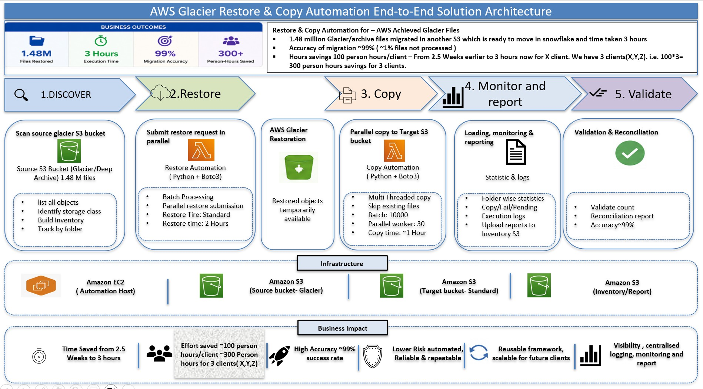

# Independent AWS Data Migration & Snowflake Consultant

Independent Data Migration Consultant specializing in AWS Glacier → S3 → Snowflake, data automation, Python, Boto3, and AI-driven data engineering.

I help organizations recover and modernize archived data by designing automated **AWS Glacier → S3 → Processing → Snowflake** data pipelines.

## 🚀 Proven Delivery

**5 Million Files | 100 GB | 12 Hours**

Designed and implemented an automated AWS Glacier data recovery and processing pipeline that recovered, processed and reconciled approximately **5 million archived files totaling 100 GB within 12 hours**.

## Core Consulting Services

- AWS S3 Glacier / Glacier Deep Archive data retrieval
- Large-scale archived file restoration
- Automated Glacier restore and S3 copy workflows
- Cross-account AWS data migration
- EC2-based Python automation and batch processing
- S3 file validation, transformation and ingestion
- Snowflake data loading and migration
- Data reconciliation and quality validation
- Metadata discovery and migration automation
- AI-assisted data profiling and source-to-target mapping

## Specialized Solution

### AWS Glacier → S3 → Process → Snowflake

I build automated solutions for organizations that have large volumes of historical or archived data in AWS Glacier and need to make that data available for analytics, migration, regulatory, or Snowflake ingestion.

**Glacier Restore → S3 Copy → File Extraction → Processing → Reconciliation → Snowflake**

## Key Achievement

### 5 Million Files | 100 GB | Completed Within 12 Hours

The solution automated:

- Large-scale parallel Glacier restore processing
- Automated copying of restored objects to S3
- Automated decompression / extraction
- Batch processing and multithreading
- Retry and error handling
- Duplicate / already-processed file handling
- File-level reconciliation
- Processing status and operational logging
- EC2-based Python automation using Boto3

### Business Outcome

Replaced a highly manual and time-consuming archived-data recovery process with an automated, repeatable and scalable workflow.

## Typical Engagement

### 1. Discover
Assess archived S3/Glacier data, file formats, volumes, prefixes and dependencies.

### 2. Restore
Automate Glacier restore requests with parallel processing, batching, retry handling and restore-status tracking.

### 3. Retrieve
Copy restored objects to the required S3 landing location while avoiding duplicate processing.

### 4. Process
Validate, decompress, transform and prepare archived files for downstream ingestion.

### 5. Load
Load processed data into Snowflake using scalable ingestion patterns.

### 6. Reconcile
Validate source-to-target completeness, file counts, record counts, data quality and migration results.

## Technology

`AWS` · `S3` · `Glacier` · `EC2` · `IAM` · `Python` · `Boto3` · `Snowflake` · `SQL` · `ETL/ELT` · `Data Migration` · `Data Quality` · `AI/LLM`

## Consulting Focus

I specialize in helping organizations replace **manual, time-consuming Glacier recovery and migration processes** with repeatable, automated data migration frameworks.

My focus is on **enterprise-scale data recovery, migration automation, Snowflake modernization, data quality and AI-assisted data engineering**.

For consulting engagements involving AWS archived data recovery, migration automation, Snowflake ingestion or enterprise data modernization, please connect with me.
